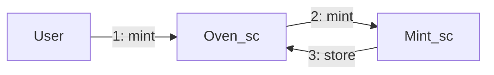
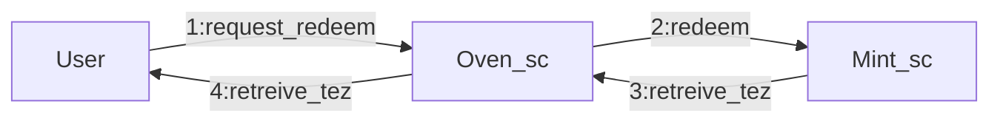

# Ticket Factory

This small project offers two smart-contracts that allow to exchange tickets
(with a fixed `payload`). For a `mutez` you get a ticket. The code is not very
interesting, it will only serve to illustrate the use of the test framework.

## Global Workflow

There are two contracts: 
- `oven_sc`: that acts as a bit of a client. A user can originate his oven and it
  is this contract that will interact with the ticket creation contract.
- `mint_sc`: whose role is to receive `mutez` and convert them into tickets, and
  then return them to the `oven` that requested the ticket forge.
  
### Mint

- An user can originate an `oven_sc` with a fixed address (as an owner of the `oven`).
- He can interact with the `oven_sc` to request the `mint` of a ticket that will be sent
  to the `mint_sc` contract.
- The `mint_sc` contract keep the amount of `tez` sent, produce a quantity of the ticket
  and give it back to the `oven_sc`.
  

  
### Redeem

When the user wants to exchange his tickets for `xtz`, he can also do so. This
is what gives a ticket a concrete value. `Redeem` is the opposite of `Mint`.

- An user can ask for a `Redeem` to `mint_sc`.
- He can interact with the `oven_sc` to request the `redeem` of a quantity of ticket
  that will be sent to the `mint_sc` contract.
- The `mint_sc` contract burn the ticket and send `tez` back to the `oven_sc` that will
  send the `tez` back to the user.
  

